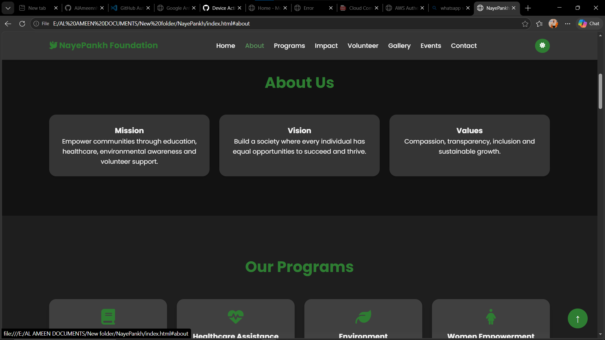
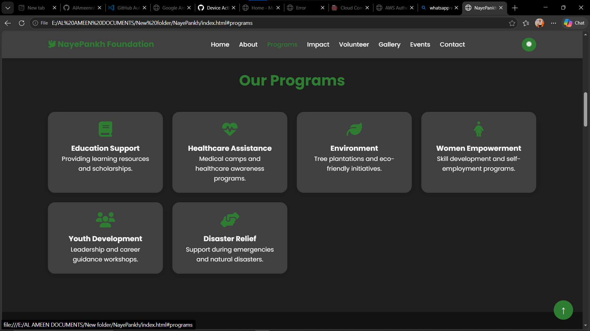
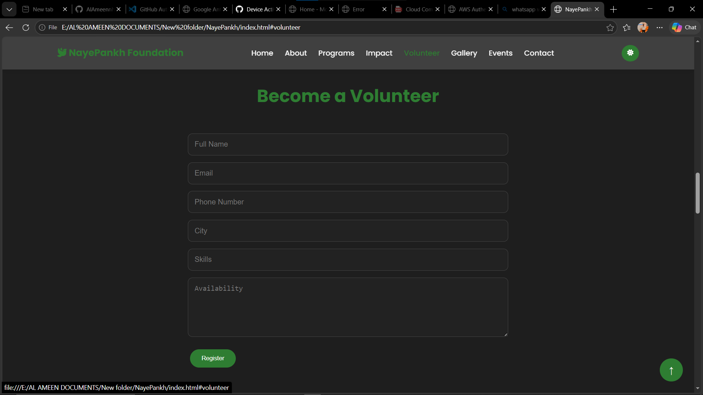
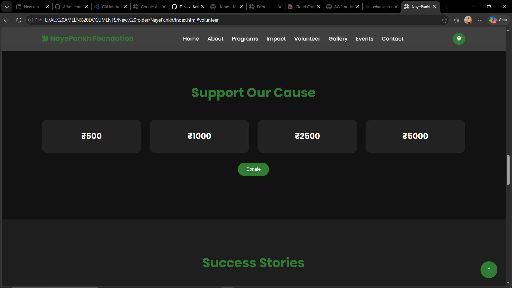
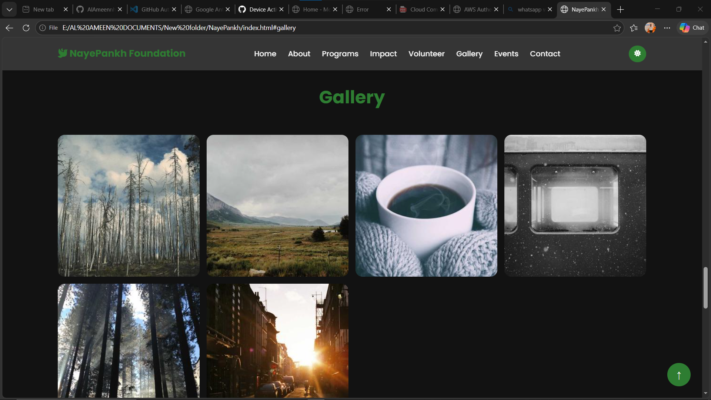
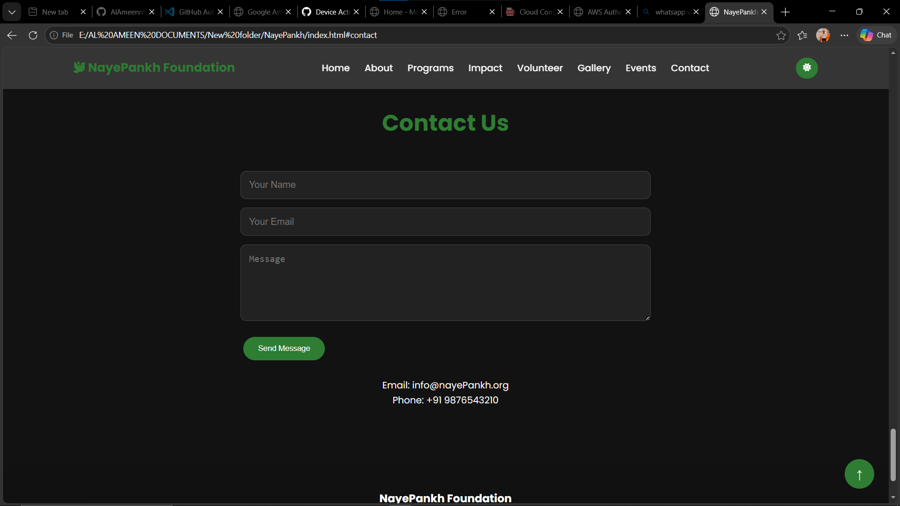

# NayePankh Foundation 🌱

A modern, responsive NGO website built using HTML, CSS, and JavaScript.

## 📌 Overview

NayePankh Foundation is a front-end web project designed for a non-profit organization. The website provides information about the foundation's mission, programs, impact, volunteer opportunities, donations, events, and contact details through a clean and engaging user interface.

## ✨ Features

* Responsive Design
* Dark Mode Support
* Volunteer Registration Form
* Donation Section
* Animated Impact Counters
* Testimonials Slider
* Gallery Lightbox
* Contact Form
* Smooth Scrolling Navigation
* Mobile-Friendly Layout
* Glassmorphism UI Components

## 🛠️ Technologies Used

* HTML5
* CSS3
* JavaScript
* Font Awesome
* Local Storage API

## 📸 Screenshots

### Home Page


### About Section



### Programs Section



### Volunteer Registration



### Donation Section



### Gallery



### Contact Page



## 🚀 Installation

1. Clone the repository

```bash
git clone https://github.com/AlAmeennh/NayePankh-Foundation.git
```

2. Open the project folder

```bash
cd NayePankh-Foundation
```

3. Open `index.html` in your browser

## 📂 Project Structure

```text
NayePankh-Foundation/
│
├── index.html
├── style.css
├── script.js
├── screenshots/
│   ├── home.png
│   ├── about.png
│   ├── programs.png
│   ├── volunteer.png
│   ├── donation.png
│   ├── gallery.png
│   └── contact.png
└── README.md
```

## 👨‍💻 Author

**AL AMEEN N H**

Final Year B.Tech Student

## 📜 License

This project is open source and available under the MIT License.
